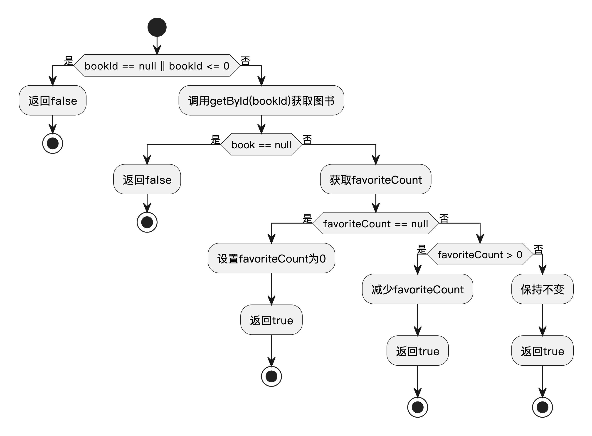

# 书海阁项目综合测试用例设计（JUnit实现版）

## 一、图书管理模块测试(范仕洲)

### 1. 白盒测试

本节对BookServiceImpl类中的方法进行白盒测试设计，包括选择结构测试和循环结构测试两部分。

#### 1.1 选择结构测试

选择结构测试针对具有多个条件判断和分支的代码，测试不同条件组合下的程序行为。

##### 1.1.1 测试代码 - getBookDetail方法

```java
@Override
public Book getBookDetail(Long id) {
    // 添加输入验证和边界条件
    if (id == null || id <= 0) {
        return null;
    }
    
    Book book = getById(id);
    
    // 对图书信息进行后处理（适合测试）
    if (book != null) {
        // 确保作者字段不为空（数据规范化）
        if (book.getAuthor() == null || book.getAuthor().isEmpty()) {
            book.setAuthor("未知作者");
        }
    }
    
    return book;
}
```

##### 1.1.2 方法流程图


##### 1.1.3 语句覆盖用例

| 用例ID | 场景 | 输入 | 预期结果 | 备注 |
|--------|------|------|----------|------|
| SB01 | id为null | id=null | 返回null | id为null分支 |
| SB02 | id<=0 | id=0 | 返回null | id<=0分支 |
| SB03 | 图书不存在 | id=99999 | 返回null | 图书不存在分支 |
| SB04 | 作者为null | id=1, book.author=null | 返回规范化后的图书 | 作者为null分支 |
| SB05 | 作者为空字符串 | id=2, book.author="" | 返回规范化后的图书 | 作者为空分支 |
| SB06 | 作者正常 | id=3, book.author="张三" | 返回原图书不变 | 作者正常分支 |

##### 1.1.4 判定覆盖用例

判定覆盖要求每个if/else分支的真假都被覆盖。下列判定已被语句覆盖用例SB01~SB06覆盖，具体对应如下：

- `if (id == null || id <= 0)`：SB01（id为null为真），SB02（id<=0为真），SB03~SB06（为假）
- `if (book != null)`：SB03（为假），SB04~SB06（为真）
- `if (book.getAuthor() == null || book.getAuthor().isEmpty())`：SB04（author为null为真），SB05（author为空为真），SB06（为假）

**结论：判定覆盖已由SB01~SB06用例全部覆盖，无需新增用例。**

##### 1.1.5 条件覆盖用例

条件覆盖要求复合条件中每个子条件都取到真和假。以`if (id == null || id <= 0)`为例：

- `id == null`为真：SB01
- `id == null`为假：SB02~SB06
- `id <= 0`为真：SB02
- `id <= 0`为假：SB01, SB03~SB06

以`if (book.getAuthor() == null || book.getAuthor().isEmpty())`为例：

- `book.getAuthor() == null`为真：SB04
- `book.getAuthor() == null`为假：SB05, SB06
- `book.getAuthor().isEmpty()`为真：SB05
- `book.getAuthor().isEmpty()`为假：SB04, SB06

其余条件同理，SB01~SB06已覆盖所有子条件真假。

**结论：条件覆盖已由SB01~SB06用例全部覆盖，无需新增用例。**

##### 1.1.6 路径覆盖用例

路径覆盖（Path Coverage）要求测试用例能够覆盖方法中所有主要的执行路径。对于 `getBookDetail` 方法，主要路径如下：

- 路径1：id为null或<=0 → 返回null
- 路径2：id有效，图书不存在 → 返回null
- 路径3：id有效，图书存在，作者为null → 规范化作者，返回图书
- 路径4：id有效，图书存在，作者为空字符串 → 规范化作者，返回图书
- 路径5：id有效，图书存在，作者正常 → 返回原图书

对应的测试用例如下：

| 用例ID | 覆盖路径 | 场景描述 |
|--------|----------|----------|
| SB01   | 路径1    | id为null，返回null |
| SB02   | 路径1    | id<=0，返回null |
| SB03   | 路径2    | id有效，图书不存在，返回null |
| SB04   | 路径3    | id有效，图书存在，作者为null，返回规范化图书 |
| SB05   | 路径4    | id有效，图书存在，作者为空字符串，返回规范化图书 |
| SB06   | 路径5    | id有效，图书存在，作者正常，返回原图书 |

**结论：用例SB01~SB06已覆盖该方法的所有主要执行路径，确保了路径覆盖的完整性。**

##### 1.1.7 判定/条件组合覆盖

本方法无复杂多条件判定，无需单独进行判定/条件组合覆盖，相关分支已在条件覆盖用例中全部覆盖。

---

#### 1.2 循环结构测试

循环结构测试关注程序中的循环语句，测试不同循环次数和循环体内执行路径的情况。

##### 1.2.1 测试代码 - listAllBooks方法循环部分

```java
// 循环结构 - 遍历所有图书
List<Book> filteredBooks = new ArrayList<>();
for (Book book : allBooks) {
    // 初始化匹配标志
    boolean nameMatch = false;
    boolean authorMatch = false; 
    boolean categoryMatch = false;
    
    // 检查各字段是否匹配 (省略内部判断代码)
    
    // 满足条件则添加到结果集
    if (nameMatch || authorMatch || categoryMatch) {
        filteredBooks.add(book);
    }
}
```

##### 1.2.2 方法流程图


##### 1.2.3 循环结构覆盖用例

本节采用经典的“七次循环测试用例设计”法，覆盖循环体的所有典型和边界情况。由于本方法理论上无循环上限，max/max-1/max+1用10000、9999、10001等大数模拟，实际测试时可根据系统资源调整。

| 用例ID | 场景 | 输入 | 预期结果 | 备注 |
|--------|------|------|----------|------|
| SB_L01 | 0次 | allBooks=[], 任意查询词 | 返回空列表 | 循环体0次 |
| SB_L02 | 1次 | allBooks=[book1], 匹配的查询词 | 返回[book1] | 循环体1次，匹配 |
| SB_L03 | 2次 | allBooks=[book1, book2], 匹配部分 | 返回部分匹配的图书 | 循环体2次，部分匹配 |
| SB_L04 | m次 | allBooks=[book1, ..., book5], 匹配部分 | 返回部分匹配的图书 | m=5，部分匹配 |
| SB_L05 | max-1次 | allBooks=9999本书，匹配全部 | 返回9999本 | max-1=9999，模拟大数据量 |
| SB_L06 | max次 | allBooks=10000本书，匹配全部 | 返回10000本 | max=10000，极大数据量 |
| SB_L07 | max+1次 | allBooks=10001本书，匹配全部 | 返回10001本或系统提示 | max+1=10001，极端边界 |

### 2. 黑盒测试（等价类划分法）

#### 1.1 测试对象描述

"添加图书"功能要求用户填写图书的标题、作者、分类、价格和描述。系统对这些输入有如下校验规则：标题为必填项，长度必须在1到50个字符之间；作者为必填项，长度必须在1到30个字符之间；分类为必填项，长度必须在1到20个字符之间；价格为必填项，必须为0.01到9999.99之间的数值；描述为可选项，长度不能超过200个字符。如果输入不满足上述任一条件，系统应给出相应的错误提示并拒绝添加。

#### 1.2 等价类划分

| 条件描述                     | 有效等价类（编号Ex）         | 无效等价类（编号Ix）         |
|------------------------------|-----------------------------|-----------------------------|
| 标题长度为1-50个字符         | E1: 标题长度1-50            | I1: 标题为空<br>I2: 标题超50字符 |
| 作者长度为1-30个字符         | E2: 作者长度1-30            | I3: 作者为空<br>I4: 作者超30字符 |
| 分类长度为1-20个字符         | E3: 分类长度1-20            | I5: 分类为空<br>I6: 分类超20字符 |
| 价格为0.01-9999.99           | E4: 价格0.01-9999.99        | I7: 价格小于0.01<br>I8: 价格大于9999.99 |
| 描述长度为0-200个字符        | E5: 描述长度0-200           | I9: 描述超200字符            |

#### 1.3 测试用例设计

| 测试用例ID | 测试用例名称         | 测试输入                                                         | 预期结果                   | 覆盖等价类         |
| ---------- | -------------------- | ---------------------------------------------------------------- | -------------------------- | ------------------ |
| TC-B01     | 标准有效输入         | 标题: "Java编程"<br>作者: "张三"<br>分类: "编程"<br>价格: 88.5<br>描述: "入门教程" | 添加成功                   | E1,E2,E3,E4,E5     |
| TC-B02     | 标题为空             | 标题: ""<br>作者: "张三"<br>分类: "编程"<br>价格: 88.5      | 添加失败，提示标题不能为空 | I1                 |
| TC-B03     | 标题超长             | 标题: 51字符<br>作者: "张三"<br>分类: "编程"<br>价格: 88.5    | 添加失败，提示标题过长     | I2                 |
| TC-B04     | 作者超长             | 标题: "Java"<br>作者: 31字符<br>分类: "编程"<br>价格: 88.5    | 添加失败，提示作者过长     | I4                 |
| TC-B05     | 分类为空             | 标题: "Java"<br>作者: "张三"<br>分类: ""<br>价格: 88.5      | 添加失败，提示分类不能为空 | I5                 |
| TC-B06     | 价格为0              | 标题: "Java"<br>作者: "张三"<br>分类: "编程"<br>价格: 0     | 添加失败，提示价格无效     | I7                 |
| TC-B07     | 价格超上限           | 标题: "Java"<br>作者: "张三"<br>分类: "编程"<br>价格: 10000 | 添加失败，提示价格无效     | I8                 |
| TC-B08     | 标题边界（1字符）    | 标题: "J"<br>作者: "张三"<br>分类: "编程"<br>价格: 88.5     | 添加成功                   | E1                 |
| TC-B09     | 价格边界（0.01）     | 标题: "Java"<br>作者: "张三"<br>分类: "编程"<br>价格: 0.01  | 添加成功                   | E4                 |
| TC-B10     | 描述超长             | 标题: "Java"<br>作者: "张三"<br>分类: "编程"<br>价格: 88.5<br>描述: 201字符 | 添加失败，提示描述过长     | I9                 |

## 二、图书搜索模块测试(管海峰)

### 1. 白盒测试

本节对BookServiceImpl类中的图书搜索相关方法进行白盒测试设计，包括选择结构测试和循环结构测试。

#### 1.1 选择结构测试

选择结构测试针对具有多个条件判断和分支的代码，测试不同条件组合下的程序行为。

##### 1.1.1 测试代码 - decrementFavoriteCount方法

```java
/**
 * 减少图书收藏数
 */
public boolean decrementFavoriteCount(Long bookId) {
    // 参数验证
    if (bookId == null || bookId <= 0) {
        return false;
    }
    
    // 获取图书
    Book book = getById(bookId);
    if (book == null) {
        return false;
    }
    
    // 处理收藏数
    Integer favoriteCount = book.getFavoriteCount();
    
    if (favoriteCount == null) {
        // 如果收藏数为null，设置为0
        book.setFavoriteCount(0);
        return true;
    } else if (favoriteCount > 0) {
        // 正常减少收藏数
        book.setFavoriteCount(favoriteCount - 1);
        return true;
    } else {
        // 收藏数已经是0，不做变更
        return true;
    }
}
```

##### 1.1.2 方法流程图



##### 1.1.3 语句覆盖用例

| 用例ID | 场景 | 输入 | 预期结果 | 备注 |
|--------|------|------|----------|------|
| SC01 | bookId为null | bookId=null | 返回false | 参数校验分支 |
| SC02 | bookId<=0 | bookId=0 | 返回false | 参数校验分支 |
| SC03 | 图书不存在 | bookId=99999 | 返回false | 图书不存在分支 |
| SC04 | 收藏数为null | bookId=1, favoriteCount=null | 收藏数设为0，返回true | favoriteCount为null分支 |
| SC05 | 收藏数大于0 | bookId=1, favoriteCount=5 | 收藏数减1，返回true | favoriteCount>0分支 |
| SC06 | 收藏数为0 | bookId=1, favoriteCount=0 | 收藏数不变，返回true | favoriteCount=0分支 |

##### 1.1.4 判定覆盖用例

判定覆盖要求每个if/else分支的真假都被覆盖。下列判定已被语句覆盖用例SC01~SC06覆盖，具体对应如下：

- `if (bookId == null || bookId <= 0)`：SC01（为真），SC02（为真），SC03~SC06（为假）
- `if (book == null)`：SC03（为真），SC04~SC06（为假）
- `if (favoriteCount == null)`：SC04（为真），SC05~SC06（为假）
- `else if (favoriteCount > 0)`：SC05（为真），SC06（为假）

**结论：判定覆盖已由SC01~SC06用例全部覆盖，无需新增用例。**

##### 1.1.5 条件覆盖用例

条件覆盖要求复合条件中每个子条件都取到真和假。以`if (bookId == null || bookId <= 0)`为例：

- `bookId == null`为真：SC01
- `bookId == null`为假：SC02~SC06
- `bookId <= 0`为真：SC02
- `bookId <= 0`为假：SC01, SC03~SC06

其余条件同理，SC01~SC06已覆盖所有子条件真假。

**结论：条件覆盖已由SC01~SC06用例全部覆盖，无需新增用例。**

##### 1.1.6 路径覆盖用例

路径覆盖（Path Coverage）要求测试用例能够覆盖方法中所有主要的执行路径。对于 `decrementFavoriteCount` 方法，主要路径如下：

- 路径1：参数校验失败（bookId为null或<=0）→ 返回false
- 路径2：参数校验通过，但图书不存在 → 返回false
- 路径3：参数校验通过，图书存在，收藏数为null → 收藏数设为0，返回true
- 路径4：参数校验通过，图书存在，收藏数大于0 → 收藏数减1，返回true
- 路径5：参数校验通过，图书存在，收藏数为0 → 收藏数不变，返回true

对应的测试用例如下：

| 用例ID | 覆盖路径 | 场景描述 |
|--------|----------|----------|
| SC01   | 路径1    | bookId为null，参数校验失败，直接返回false |
| SC02   | 路径1    | bookId<=0，参数校验失败，直接返回false |
| SC03   | 路径2    | bookId有效，但图书不存在，返回false |
| SC04   | 路径3    | 图书存在，收藏数为null，设为0并返回true |
| SC05   | 路径4    | 图书存在，收藏数大于0，减1并返回true |
| SC06   | 路径5    | 图书存在，收藏数为0，不变并返回true |

**结论：用例SC01~SC06已覆盖该方法的所有主要执行路径，确保了路径覆盖的完整性。**

##### 1.1.7 判定/条件组合覆盖

本模块方法无复杂多条件判定，无需单独进行判定/条件组合覆盖，相关分支已在条件覆盖用例中全部覆盖。

---

#### 1.2 循环结构测试

循环结构测试关注程序中的循环语句，测试不同循环次数和循环体内执行路径的情况。

##### 1.2.1 测试代码 - listAllBooksAndSortByFavoriteCount方法循环部分

```java
/**
 * 获取按收藏量排序的图书
 */
public List<Book> listAllBooksAndSortByFavoriteCount(String query, String sortType) {
    // 获取所有图书
    List<Book> allBooks = list();
    List<Book> result = new ArrayList<>();
    
    // 手动循环实现过滤
    for (Book book : allBooks) {
        // 无查询条件或者书名/作者匹配时添加到结果集
        if (!StringUtils.hasText(query) || 
            (book.getName() != null && book.getName().toLowerCase().contains(query.toLowerCase())) || 
            (book.getAuthor() != null && book.getAuthor().toLowerCase().contains(query.toLowerCase()))) {
            
            result.add(book);
        }
    }
    
    // 注：此处省略排序逻辑
    // 根据sortType参数对result列表进行按收藏量排序
    
    return result;
}
```

##### 1.2.2 方法流程图


##### 1.2.3 循环结构覆盖用例

本节采用经典的"七次循环测试用例设计"法，覆盖循环体的所有典型和边界情况。由于本方法理论上无循环上限，max/max-1/max+1用10000、9999、10001等大数模拟，实际测试时可根据系统资源调整。

| 用例ID | 场景 | 输入 | 预期结果 | 备注 |
|--------|------|------|----------|------|
| LC01 | 0次 | allBooks=[], query任意 | 返回空列表 | 循环体0次 |
| LC02 | 1次 | allBooks=[book1], query匹配 | 返回[book1] | 循环体1次，匹配 |
| LC03 | 2次 | allBooks=[book1, book2], query匹配 | 返回[book1, book2] | 循环体2次，全部匹配 |
| LC04 | m次 | allBooks=[book1, book2, book3, book4, book5], query匹配部分 | 返回部分匹配的图书 | m=5，部分匹配 |
| LC05 | max-1次 | allBooks=9999本书，query匹配全部 | 返回9999本 | max-1=9999，模拟大数据量 |
| LC06 | max次 | allBooks=10000本书，query匹配全部 | 返回10000本 | max=10000，极大数据量 |
| LC07 | max+1次 | allBooks=10001本书，query匹配全部 | 返回10001本或系统提示 | max+1=10001，极端边界 |

### 2. 黑盒测试（等价类划分法）

#### 2.1 测试对象描述

"图书搜索"功能允许用户输入图书标题关键词和作者关键词进行模糊查询，并可选择按收藏量升序或降序排序。标题关键词和作者关键词均为可选项，分别要求长度不超过50个字符和30个字符。排序类型参数可选，允许值为"asc"（升序）、"desc"（降序）或为空（默认降序）。如果输入参数不符合要求，系统应提示输入错误，否则返回满足条件的图书列表。

#### 2.2 等价类划分

| 条件描述                     | 有效等价类（编号Ex）         | 无效等价类（编号Ix）         |
|------------------------------|-----------------------------|-----------------------------|
| 标题关键词长度为0-50字符     | E1: 标题关键词0-50字符      | I1: 标题关键词超50字符       |
| 作者关键词长度为0-30字符     | E2: 作者关键词0-30字符      | I2: 作者关键词超30字符       |
| 排序类型为asc/desc/空        | E3: 排序类型为asc/desc/空   | I3: 排序类型为其他非法值     |

#### 2.3 测试用例设计

| 测试用例ID | 测试用例名称         | 测试输入                                                         | 预期结果                   | 覆盖等价类         |
| ---------- | -------------------- | ---------------------------------------------------------------- | -------------------------- | ------------------ |
| TC-S01     | 标准有效输入         | 标题关键词: "Java"<br>作者关键词: "张三"<br>排序类型: "desc" | 返回符合条件的图书列表      | E1,E2,E3           |
| TC-S02     | 标题关键词超长       | 标题关键词: 51字符<br>作者关键词: "张三"<br>排序类型: "desc" | 输入错误，提示标题关键词过长 | I1                 |
| TC-S03     | 作者关键词超长       | 标题关键词: "Java"<br>作者关键词: 31字符<br>排序类型: "desc" | 输入错误，提示作者关键词过长 | I2                 |
| TC-S04     | 排序类型非法         | 标题关键词: "Java"<br>作者关键词: "张三"<br>排序类型: "up" | 输入错误，提示排序类型非法   | I3                 |
| TC-S05     | 仅标题关键词有效     | 标题关键词: "Python"<br>作者关键词: ""<br>排序类型: "asc" | 返回标题匹配的图书列表      | E1,E3              |
| TC-S06     | 仅作者关键词有效     | 标题关键词: ""<br>作者关键词: "李四"<br>排序类型: "desc" | 返回作者匹配的图书列表      | E2,E3              |
| TC-S07     | 仅排序类型为空       | 标题关键词: ""<br>作者关键词: ""<br>排序类型: "" | 返回全部图书，按默认降序排序 | E3                 |

## 三、收藏管理模块测试(吴豪)

### 1. 白盒测试

本节对FavoriteServiceImpl类中的收藏管理相关方法进行白盒测试设计，包括选择结构测试和循环结构测试。

#### 1.1 选择结构测试

选择结构测试针对具有条件判断和多个分支路径的代码进行测试。

##### 1.1.1 测试代码 - addFavorite方法

```java
/**
 * 添加收藏
 */
public boolean addFavorite(Long userId, Long bookId) {
    // 参数验证
    if (userId == null || bookId == null) {
        return false;
    }
    
    // 检查是否已收藏
    if (isAlreadyFavorite(userId, bookId)) {
        return false;
    }
    
    // 保存收藏记录(省略实际保存操作)
    return true;
}
```

##### 1.1.2 方法流程图


##### 1.1.3 语句覆盖用例

| 用例ID | 场景 | 输入 | 预期结果 | 备注 |
|--------|------|------|----------|------|
| SF01 | userId为null | userId=null, bookId=1 | 返回false | userId为null分支 |
| SF02 | bookId为null | userId=1, bookId=null | 返回false | bookId为null分支 |
| SF03 | 已收藏 | userId=1, bookId=1, 已收藏 | 返回false | 已收藏分支 |
| SF04 | 正常收藏 | userId=1, bookId=1, 未收藏 | 返回true | 正常收藏分支 |

##### 1.1.4 判定覆盖用例

判定覆盖要求每个if/else分支的真假都被覆盖。下列判定已被语句覆盖用例SF01~SF04覆盖，具体对应如下：

- `if (userId == null || bookId == null)`：SF01（userId为null为真），SF02（bookId为null为真），SF03、SF04（为假）
- `if (isAlreadyFavorite(userId, bookId))`：SF03（为真），SF04（为假）

**结论：判定覆盖已由SF01~SF04用例全部覆盖，无需新增用例。**

##### 1.1.5 条件覆盖用例

条件覆盖要求复合条件中每个子条件都取到真和假。以`if (userId == null || bookId == null)`为例：

- `userId == null`为真：SF01
- `userId == null`为假：SF02~SF04
- `bookId == null`为真：SF02
- `bookId == null`为假：SF01, SF03, SF04

其余条件同理，SF01~SF04已覆盖所有子条件真假。

**结论：条件覆盖已由SF01~SF04用例全部覆盖，无需新增用例。**

##### 1.1.6 路径覆盖用例

路径覆盖（Path Coverage）要求测试用例能够覆盖方法中所有主要的执行路径。对于 `addFavorite` 方法，主要路径如下：

- 路径1：参数校验失败（userId为null或bookId为null）→ 返回false
- 路径2：参数校验通过，已收藏 → 返回false
- 路径3：参数校验通过，未收藏 → 添加收藏，返回true

对应的测试用例如下：

| 用例ID | 覆盖路径 | 场景描述 |
|--------|----------|----------|
| SF01   | 路径1    | userId为null，参数校验失败，返回false |
| SF02   | 路径1    | bookId为null，参数校验失败，返回false |
| SF03   | 路径2    | 已收藏，返回false |
| SF04   | 路径3    | 未收藏，添加收藏并返回true |

**结论：用例SF01~SF04已覆盖该方法的所有主要执行路径，确保了路径覆盖的完整性。**

##### 1.1.7 判定/条件组合覆盖

本方法无复杂多条件判定，无需单独进行判定/条件组合覆盖，相关分支已在条件覆盖用例中全部覆盖。

---

#### 1.2 循环结构测试

循环结构测试关注代码中的循环语句，测试不同循环次数和循环体内执行路径的情况。

##### 1.2.1 测试代码 - getOrderedFavoriteBooks方法

```java
/**
 * 按收藏顺序获取图书列表
 */
public List<Book> getOrderedFavoriteBooks(List<Long> bookIds, List<Book> allBooks) {
    // 参数验证
    if (bookIds == null || allBooks == null) {
        return new ArrayList<>();
    }
    
    // 按ID顺序排列图书
    List<Book> result = new ArrayList<>();
    for (Long id : bookIds) {
        for (Book book : allBooks) {
            if (book.getId().equals(id)) {
                result.add(book);
                break;
            }
        }
    }
    
    return result;
}
```

##### 1.2.2 方法流程图


##### 1.2.3 循环结构覆盖用例

本节采用经典的"七次循环测试用例设计"法，覆盖循环体的所有典型和边界情况。由于本方法理论上无循环上限，max/max-1/max+1用10000、9999、10001等大数模拟，实际测试时可根据系统资源调整。

| 用例ID | 场景 | 输入 | 预期结果 | 备注 |
|--------|------|------|----------|------|
| LF01 | 0次 | bookIds=[], allBooks=[] | 返回空列表 | 外层循环0次 |
| LF02 | 1次 | bookIds=[1], allBooks=[id=1的图书] | 返回包含一本图书的列表 | 外层循环1次，内层循环1次，匹配 |
| LF03 | 2次 | bookIds=[1,2], allBooks=[id=1,2的图书] | 返回2本图书列表 | 外层循环2次，内层循环2次，全部匹配 |
| LF04 | m次 | bookIds=[1,2,3,4,5], allBooks=[id=1,2,3,4,5的图书] | 返回5本图书列表 | m=5，全部匹配 |
| LF05 | max-1次 | bookIds=9999个ID, allBooks=9999本图书 | 返回9999本图书 | max-1=9999，模拟大数据量 |
| LF06 | max次 | bookIds=10000个ID, allBooks=10000本图书 | 返回10000本图书 | max=10000，极大数据量 |
| LF07 | max+1次 | bookIds=10001个ID, allBooks=10001本图书 | 返回10001本图书或系统提示 | max+1=10001，极端边界 |

### 2. 黑盒测试（等价类划分法）

#### 2.1 测试对象描述

"收藏管理"功能允许用户对图书进行收藏和取消收藏操作。用户需输入用户ID和图书ID，系统要求这两个ID均为正整数且必须存在于系统中。对于收藏操作，若该用户已收藏该图书，则不能重复收藏；对于取消收藏操作，若未收藏则不能取消。所有输入参数必须合法，否则系统应提示错误，操作失败。

#### 2.2 等价类划分

| 条件描述                     | 有效等价类（编号Ex）         | 无效等价类（编号Ix）         |
|------------------------------|-----------------------------|-----------------------------|
| 用户ID为已存在的正整数       | E1: 用户ID为有效正整数且存在 | I1: 用户ID为负数/零/不存在   |
| 图书ID为已存在的正整数       | E2: 图书ID为有效正整数且存在 | I2: 图书ID为负数/零/不存在   |
| 收藏前未收藏该图书           | E3: 用户未收藏该图书         | I3: 用户已收藏该图书         |
| 取消前已收藏该图书           | E4: 用户已收藏该图书         | I4: 用户未收藏该图书         |

#### 2.3 测试用例设计

| 测试用例ID | 测试用例名称         | 测试输入                                                         | 预期结果                   | 覆盖等价类         |
| ---------- | -------------------- | ---------------------------------------------------------------- | -------------------------- | ------------------ |
| TC-F01     | 正常收藏             | 用户ID: 1（存在）<br>图书ID: 1（存在）<br>用户未收藏该图书         | 收藏成功                   | E1,E2,E3           |
| TC-F02     | 用户ID无效           | 用户ID: -1<br>图书ID: 1（存在）<br>用户未收藏该图书               | 收藏失败，提示用户ID无效   | I1                 |
| TC-F03     | 图书ID无效           | 用户ID: 1（存在）<br>图书ID: -1<br>用户未收藏该图书               | 收藏失败，提示图书ID无效   | I2                 |
| TC-F04     | 已收藏重复收藏       | 用户ID: 1（存在）<br>图书ID: 1（存在）<br>用户已收藏该图书           | 收藏失败，提示已收藏       | I3                 |
| TC-F05     | 正常取消收藏         | 用户ID: 1（存在）<br>图书ID: 1（存在）<br>用户已收藏该图书           | 取消收藏成功               | E1,E2,E4           |
| TC-F06     | 未收藏取消收藏       | 用户ID: 1（存在）<br>图书ID: 1（存在）<br>用户未收藏该图书           | 取消失败，提示未收藏       | I4                 |

## 四、用户界面与登录注册模块测试(刘思磊)

### 1. 白盒测试

本节对UserServiceImpl类中的用户注册登录相关方法进行白盒测试设计，包括选择结构测试和循环结构测试。

#### 1.1 选择结构测试

选择结构测试针对具有判断和多个分支的代码，测试不同条件下的程序行为。

##### 1.1.1 测试代码 - register方法

```java
/**
 * 用户注册
 */
public boolean register(User user) {
    // 检查用户名是否已存在
    if (checkUsernameExists(user.getUsername())) {
        return false;
    }
    
    // 设置默认值
    if (user.getStatus() == null) {
        user.setStatus(1); // 默认启用
    }
    
    // 保存用户
    return true;
}
```

##### 1.1.2 方法流程图


##### 1.1.3 语句覆盖用例

| 用例ID | 场景 | 输入 | 预期结果 | 备注 |
|--------|------|------|----------|------|
| SU01 | 用户名已存在 | username="已存在用户名" | 返回false | 用户名已存在分支 |
| SU02 | 状态为null | username="新用户", status=null | 设置status=1并返回true | 状态为null分支 |
| SU03 | 状态非null | username="新用户", status=2 | 保持status=2并返回true | 状态非null分支 |

##### 1.1.4 判定覆盖用例

判定覆盖要求每个if/else分支的真假都被覆盖。下列判定已被语句覆盖用例SU01~SU03覆盖，具体对应如下：

- `if (checkUsernameExists(user.getUsername()))`：SU01（为真），SU02、SU03（为假）
- `if (user.getStatus() == null)`：SU02（为真），SU03（为假）

**结论：判定覆盖已由SU01~SU03用例全部覆盖，无需新增用例。**

##### 1.1.5 条件覆盖用例

条件覆盖要求复合条件中每个子条件都取到真和假。本方法无复杂复合条件，SU01~SU03已覆盖所有条件真假。

**结论：条件覆盖已由SU01~SU03用例全部覆盖，无需新增用例。**

##### 1.1.6 路径覆盖用例

路径覆盖（Path Coverage）要求测试用例能够覆盖方法中所有主要的执行路径。对于 `register` 方法，主要路径如下：

- 路径1：用户名已存在 → 返回false
- 路径2：用户名不存在，状态为null → 设置status=1，返回true
- 路径3：用户名不存在，状态非null → 保持status不变，返回true

对应的测试用例如下：

| 用例ID | 覆盖路径 | 场景描述 |
|--------|----------|----------|
| SU01   | 路径1    | 用户名已存在，直接返回false |
| SU02   | 路径2    | 用户名不存在，状态为null，设置status=1并返回true |
| SU03   | 路径3    | 用户名不存在，状态非null，保持status不变并返回true |

**结论：用例SU01~SU03已覆盖该方法的所有主要执行路径，确保了路径覆盖的完整性。**

##### 1.1.7 判定/条件组合覆盖

本方法无复杂多条件判定，无需单独进行判定/条件组合覆盖，相关分支已在条件覆盖用例中全部覆盖。

---

#### 1.2 循环结构测试

循环结构测试关注程序中的循环语句，测试不同循环次数和循环体内执行路径的情况。

##### 1.2.1 测试代码 - validateUserBatch方法

```java
/**
 * 批量验证用户
 */
public Map<String, Boolean> validateUserBatch(List<User> users) {
    Map<String, Boolean> results = new HashMap<>();
    
    if (users == null || users.isEmpty()) {
        return results;
    }
    
    for (User user : users) {
        if (user == null || user.getUsername() == null) {
            results.put("unknown", false);
            continue;
        }
        
        String username = user.getUsername();
        boolean isValid = !checkUsernameExists(username);
        results.put(username, isValid);
    }
    
    return results;
}
```

##### 1.2.2 方法流程图


##### 1.2.3 循环结构覆盖用例

本节采用经典的"七次循环测试用例设计"法，覆盖循环体的所有典型和边界情况。由于本方法理论上无循环上限，max/max-1/max+1用10000、9999、10001等大数模拟，实际测试时可根据系统资源调整。

| 用例ID | 场景 | 输入 | 预期结果 | 备注 |
|--------|------|------|----------|------|
| LU01 | 0次 | users=null | 返回空映射 | 循环体0次 |
| LU02 | 1次 | users=[{username="test"}] | 返回包含一个用户验证结果的映射 | 循环体1次 |
| LU03 | 2次 | users=[{username="test1"}, {username="test2"}] | 返回2个用户验证结果的映射 | 循环体2次 |
| LU04 | m次 | users=[5个有效用户] | 返回5个用户验证结果的映射 | m=5，典型多次 |
| LU05 | max-1次 | users=9999个用户 | 返回9999个用户验证结果 | max-1=9999，模拟大数据量 |
| LU06 | max次 | users=10000个用户 | 返回10000个用户验证结果 | max=10000，极大数据量 |
| LU07 | max+1次 | users=10001个用户 | 返回10001个用户验证结果或系统提示 | max+1=10001，极端边界 |

### 2. 黑盒测试（等价类划分法）

#### 2.1 测试对象描述

"用户注册与登录"功能要求用户输入用户名和密码进行注册和登录。用户名为必填项，长度要求在5到20个字符之间，且必须唯一。密码为必填项，长度要求在6到20个字符之间。注册时，若用户名已存在或输入不符合要求，系统应提示错误并注册失败。登录时，若用户名不存在或密码错误，系统应提示登录失败。

#### 2.2 等价类划分

| 条件描述                 | 有效等价类（编号Ex）         | 无效等价类（编号Ix）         |
|--------------------------|-----------------------------|-----------------------------|
| 用户名长度为5-20字符且唯一 | E1: 用户名5-20字符且唯一     | I1: 用户名少于5字符<br>I2: 用户名多于20字符<br>I3: 用户名已存在 |
| 密码长度为6-20字符        | E2: 密码6-20字符            | I4: 密码少于6字符<br>I5: 密码多于20字符 |
| 登录时用户名存在          | E3: 用户名存在               | I6: 用户名不存在             |
| 登录时密码正确            | E4: 密码正确                 | I7: 密码错误                 |

#### 2.3 测试用例设计

| 测试用例ID | 测试用例名称         | 测试输入                                                         | 预期结果                   | 覆盖等价类         |
| ---------- | -------------------- | ---------------------------------------------------------------- | -------------------------- | ------------------ |
| TC-U01     | 注册成功             | 用户名: "user01"<br>密码: "passwd123"                         | 注册成功                   | E1,E2              |
| TC-U02     | 用户名过短           | 用户名: "usr"<br>密码: "passwd123"                             | 注册失败，提示用户名过短   | I1                 |
| TC-U03     | 用户名过长           | 用户名: 21字符<br>密码: "passwd123"                             | 注册失败，提示用户名过长   | I2                 |
| TC-U04     | 用户名已存在         | 用户名: "user01"（已注册）<br>密码: "passwd123"                | 注册失败，提示用户名已存在 | I3                 |
| TC-U05     | 密码过短             | 用户名: "user02"<br>密码: "123"                                | 注册失败，提示密码过短     | I4                 |
| TC-U06     | 密码过长             | 用户名: "user03"<br>密码: 21字符                                | 注册失败，提示密码过长     | I5                 |
| TC-U07     | 登录成功             | 用户名: "user01"<br>密码: "passwd123"                         | 登录成功                   | E3,E4              |
| TC-U08     | 登录用户名不存在     | 用户名: "nouser"<br>密码: "passwd123"                          | 登录失败，提示用户名不存在 | I6                 |
| TC-U09     | 登录密码错误         | 用户名: "user01"<br>密码: "wrongpass"                          | 登录失败，提示密码错误     | I7                 |
